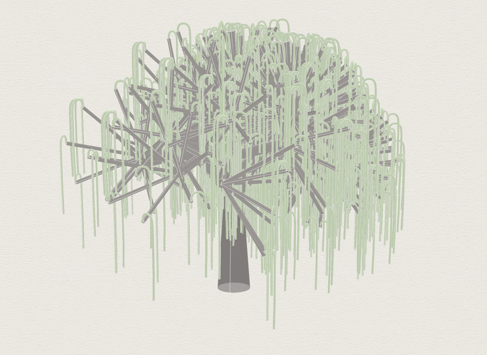

# Recursive branching structure (willow)

A fractal tree grown by **recursion**: each branch spawns children that are
shorter and thinner, iterated to depth. The parameters are the L-system's rules:

- **iteration count** — recursion depth (0–10)
- **branches per iteration** (1–5)
- **length factor** / **radius factor** — per-level decay (0.5–1.5)
- **branch length**, **trunk radius**, and the branch **angle** spread

**The algorithmic catch — and why this is the interesting one:** Grasshopper is a
*directed acyclic graph*, so it has **no native recursion**. The tree is built with
a loop construct (`Loop Start` / `Loop End`): each iteration's branch *endpoints*
are fed back in as the next iteration's *start points*, with length and radius
scaled down by the decay factors each pass. That feedback loop — recursion forced
onto a graph that can't natively express it — is the thing the node editor can't
do on its own.

**41 components, 10 parameters.**

## The definition, as code

Run through my own [Python↔Grasshopper translator](https://github.com/s-eun-young-g/pythongrasshopperinterp):

- [`branching.describe.txt`](branching.describe.txt) — the parametric system,
  including the `Loop Start` that drives the recursion.
- [`branching.py`](branching.py) — Python transcription.
- [`branching.ghx`](branching.ghx) — the source definition.
