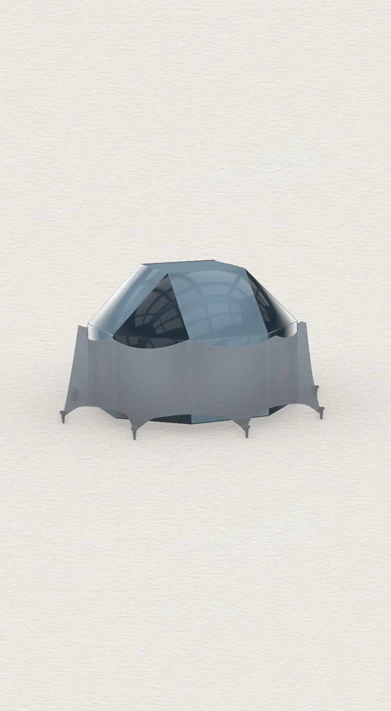

# Parametric ice-shelter dome

A faceted dome on a scalloped base wall — the largest of these studies by far at
**467 components and 124 parameters**. The form is fully parametric: the dome's
proportions, the facet/panel layout, and the scalloped footprint are all
slider-driven, so the shelter can be re-tuned and stays panelized.

**Why parametric:** at this component count, the geometry is only manageable as a
system — the faceting and the base scallops adapt to the dome's size and
proportions, so the panel layout stays buildable as the form is tuned rather than
being re-modelled.

## The definition, as code

Run through my own [Python↔Grasshopper translator](https://github.com/s-eun-young-g/pythongrasshopperinterp):

- [`icetent.describe.txt`](icetent.describe.txt) — the parametric system and the
  (467-component) pipeline.
- [`icetent.py`](icetent.py) — full transcription (components the translator
  doesn't yet map natively are flagged `gh("...")`).
- [`icetent.ghx`](icetent.ghx) — the source definition.

*This one really exercises the translator — 467 objects parsed into a single
readable inventory.*
