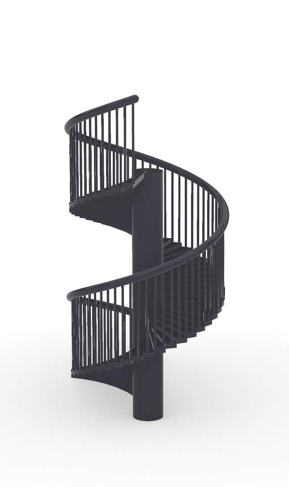

# Parametric spiral staircase

A spiral staircase generated entirely from a dozen named parameters — the slider
list reads like the design spec:

- **degrees of rotation** (360–7200°), **radius**, **height**
- **number of steps**, **number of railing poles**
- **handrail thickness**, **pole thickness** (as a % of the permitted maximum)
- **railing height band** (the 2/5–3/5 gap), **central-pole thickness**, and how far
  the **poles cut into the steps**

The definition lays points along a cylindrical helix (`Point Cylindrical` over a
`Range` of angles and elevations), builds the treads, then arrays the railing
poles and lofts the handrail around them. Push *number of steps* or *degrees of
rotation* and the whole stair re-solves.

**171 components, 12 parameters.**

**Why parametric:** the dimensional constraints (rise/run, railing height,
baluster spacing) are all sliders, so one definition yields a stair at any height,
radius, or number of turns — change the floor-to-floor height and the steps
re-space themselves instead of being redrawn.

## The definition, as code

Run through my own [Python↔Grasshopper translator](https://github.com/s-eun-young-g/pythongrasshopperinterp):

- [`staircase.describe.txt`](staircase.describe.txt) — the parametric system: all
  12 named inputs and the component pipeline.
- [`staircase.py`](staircase.py) — full transcription (components the translator
  doesn't yet map natively are flagged `gh("...")`).
- [`staircase.ghx`](staircase.ghx) — the source definition.
