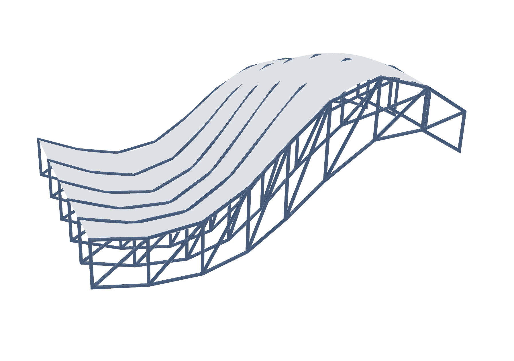

# Parametric truss canopy

A truss structure generated over a freeform surface, driven entirely by three
inputs:

- **number of columns** — bays along the span (here: 8)
- **number of trusses** — ribs across the surface (here: 5)
- **straight or curved** — toggle between a flat and a curved chord

From those, the definition divides the surface, constructs the chord and web
lines, lofts the iso-curves across the surface, and pipes + solid-unions the
members into the final canopy. Change a slider and the whole structure
re-generates.

## The definition, as code

This isn't a screenshot of a node graph — it's the actual definition run through my
own [Python↔Grasshopper translator](https://github.com/s-eun-young-g/pythongrasshopperinterp):

- [`truss2d.describe.txt`](truss2d.describe.txt) — the parametric system: every
  slider and the full component pipeline, read straight out of the definition.
- [`truss2d.py`](truss2d.py) — best-effort Python transcription (geometry ops the
  translator maps natively become real calls like `divide_curve(...)`/`line(...)`;
  the rest are flagged).
- [`truss2d.ghx`](truss2d.ghx) — the source definition (open in Grasshopper).

**Why parametric:** the truss density (columns × ribs) and the straight-vs-curved
chord stay editable as the underlying roof surface changes — every variant
re-solves instead of being redrawn by hand.
